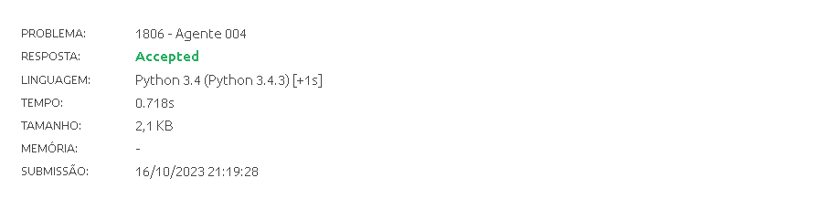

# Exercícios Juiz Online

Tema:
 - Grafos 2 

## Alunos
| Matrícula  | Aluno                   |
| ---------- | ----------------------- |
| 18/0102761 | Jefferson França Santos |
| 20/0049879 |  Yago Milagres Passos   |

## Sobre 
Exercícios do Beecrowd com nível 5 ou mais.

- [Agente 004 - 1806](https://www.beecrowd.com.br/repository/UOJ_1806.html)
- [A aventura de Super Mario - 1423](https://www.beecrowd.com.br/repository/UOJ_1423.html)
- [Dark Roads - 1152](https://www.beecrowd.com.br/repository/UOJ_1152.html)
- [Countries at War - 1148](https://www.beecrowd.com.br/repository/UOJ_1148.html)

## Screenshots

## Vídeo da apresentação
O arquivo do vídeo do exercício 1423 está presente [aqui](A_aventura_de_Super_Mario_1423/img/1423.mp4).

O arquivo do vídeo do exercício 1806 está presente [aqui](Agente_004_1806/img/1806.mp4).

O arquivo do vídeo do exercício 1148 está presente [aqui](Countries_at_War_1148/img/1148.mp4).

O arquivo do vídeo do exercício 1152 está presente [aqui](Dark_Roads_1152/img/1152.mp4).

Ou pode acessá-lo pelo link:

## Instalação 
**Linguagem**: C e Python 
[Tutorial de instalação C](https://learn.microsoft.com/pt-br/cpp/build/vscpp-step-0-installation?)

[Tutorial de instalação Python](https://www.digitalocean.com/community/tutorials/install-python-windows-10)

## Uso 
Para testar os códigos você não precisa instalar as tecnologias, você pode simplesmente copiá-los e os inserí-los em seus respectivos links do [beecrowd](https://www.beecrowd.com.br/judge/en/login).

